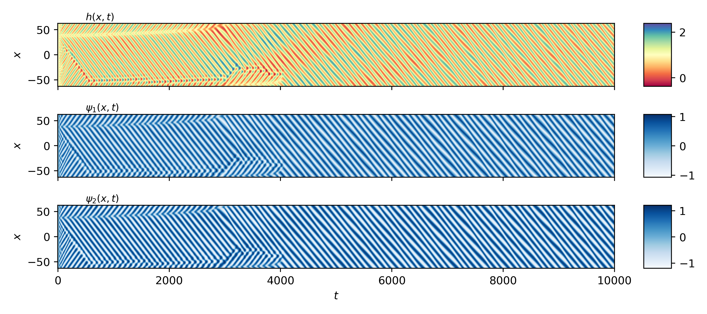
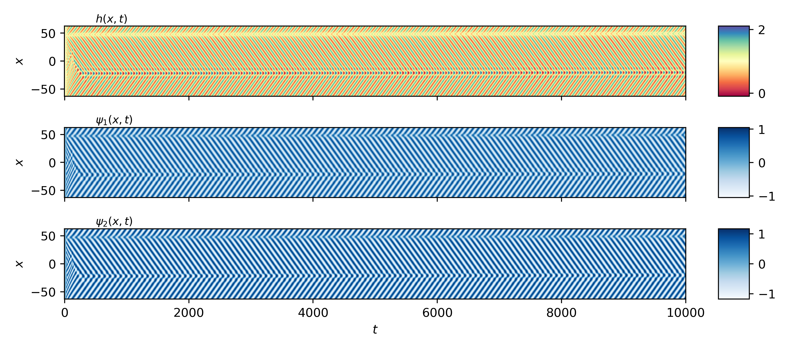

# Predicting Active Membrane Dynamics with Fourier Neural Operators

This project is a proof of principle for using machine learning to solve the coupled differential equations for an active mebrane. More detail can be found in my repository [here](https://github.com/aondoyima/active-membrane-dynamics).

The model weights are adjusted by minimising the mean square error on the prediction from one simulation step to the next, so it is remarkable that the model shows good qualitative agreement with ground truth for a full run starting from the same intital condition.

## Example
Below is a comparison between the ground truth dynamics and the FNO prediction, starting from the same initial condition.

<table>
  <tr>
    <th>Predicted</th>
    <th>Ground Truth</th>
  </tr>
  <tr>
    <td></td>
    <td></td>
  </tr>
</table>

<table>
  <tr>
    <th>Predicted</th>
    <th>Ground Truth</th>
  </tr>
  <tr>
    <td></td>
    <td></td>
  </tr>
</table>

## Limiations so far
It is likely that the sample data set is not big enough, nor does it contain a big enough variation across parameter space. The loss curves show clear overfitting with the validation loss an order of magnitude bigger than the training loss by epoch 100. However there is a steady but slow decrease in the validation loss over epochs. For more information on using FNOs to solve differential equations, see [Li et al. (2021)](https://arxiv.org/abs/2010.08895). 

