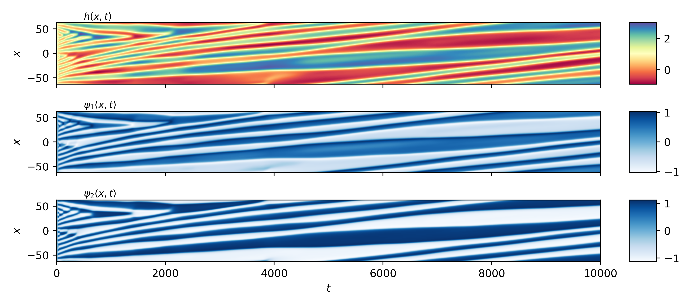
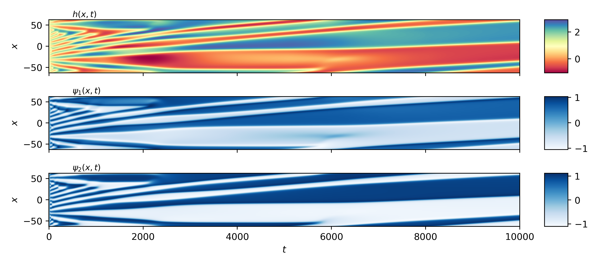

# Predicting Active Membrane Dynamics with Fourier Neural Operators

This project is a proof of principle for using machine learning to solve complex nonlinear differential equations. It serves mostly to teach myself about machine learning, but I hope that others find it useful too. 

So far the model shows good qualitative agreement with ground truth, but it is likely that the sample data set is not big enough, nor does it contain a big enough variation across parameter space. There is clear overfitting from the limited training that I have done. For more information on using FNOs to solve differential equations, see [Li et al. (2021)](https://arxiv.org/abs/2010.08895). 

## Example
The model takes in physical parameters and initial conditions, and predicts the full spatiotemporal evolution of the system.

Below is a comparison between the ground truth dynamics and the FNO prediction.

<table>
  <tr>
    <th>Predicted</th>
    <th>Ground Truth</th>
  </tr>
  <tr>
    <td></td>
    <td></td>
  </tr>
</table>
